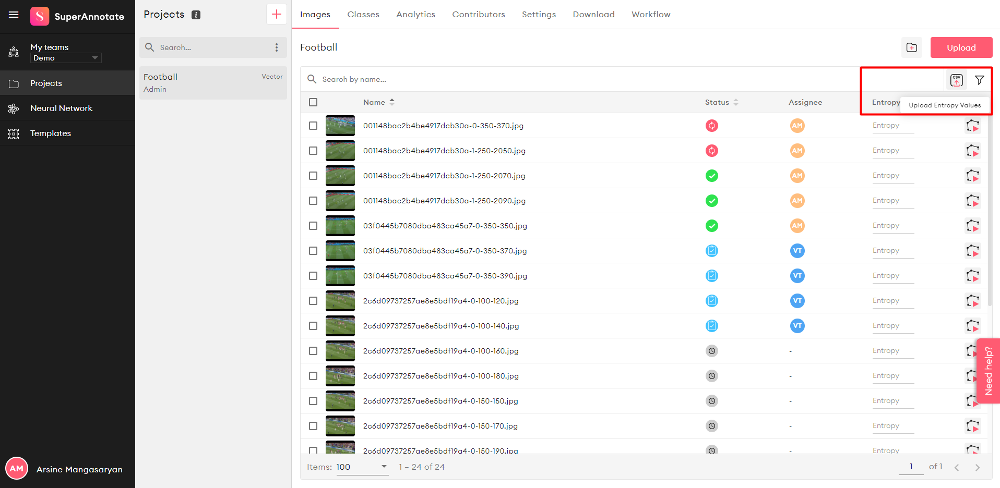

# Active Learning algorithms for classification, object detection, human pose estimation and semantic segmentation

Active Learning algorithms allow users to select a subset of his/her not yet annotated images in such a way, that annotating and adding them to the training dataset will result in highest improvement in the model's accuracy. Annotate.online allows users to upload 'entropy' csv files, which contain information on the 'entropy' value for each image, and annotate the images in the decreasing order of entropies. This way users can prioritize images to be annotated for large datasets, where annotating the whole dataset is impossible due to time and budget constaints.

Here we provide an implementation of the "Learning loss for active learning" algorithm [Learning Loss for Active Learning"](https://arxiv.org/pdf/1905.03677.pdf) for classification, object detection, human pose estimation and segmentation tasks. We also provide implementation for the [Discriminative Active Learning](https://arxiv.org/abs/1907.06347) algorithm for classification on cifar-10.

Our code runs for a few 'cycles' and selects a number of images (150 for segmentation, 1000 for the other tasks) images per cycle, then trains the model on those images. This way we mimic future user's actions, as generation of entropy values for all the images at once and annotating top N images will result in worse performance compared to repeating the process for a few cycles and re-training the model after each cycle. The code generates csv files for each cycle, which can be uploaded to [SuperAnnotate](https://app.superannotate.com).

More detailed description of our work can be found in our [Blog Post](https://blog.superannotate.com).



## Code Structure

Code for each task is provided in the coorresponding folder. Code for the active learing algorithms is in the "active_learning" folder.

## Used open-source models

For each of 4 tasks we used an open-source repository to demonstrate the active learning algorithms. Please refer to the corresponding repo's instructions for setup.

- [Classification on Cifar 10 using resnet-18 model](https://github.com/kuangliu/pytorch-cifar)
- [Object Detection on Paskal VOC using SSD algorithm](https://github.com/amdegroot/ssd.pytorch)
- [Human Pose estimation on Coco dataset with Deep High-Resolution Representation Learning model](https://github.com/leoxiaobin/deep-high-resolution-net.pytorch)
- [Segmentation on Cityscapes dataset with “Dilated Residual Networks” model](https://github.com/fyu/drn)

## Running the code
Before running the code you will need to setup the dataset. For instruction please refer to the README files of used open-source repos.
 
### Classification on cifar-10 with resnet-18
```bash
cd classification/cifar-resnet-classification
# For running with random selection.
python3 cifar_resnet_clasification.py
# For running with loss prediction active learning.
python3 cifar_resnet_clasification.py --use_loss_prediction_al=True
# For running with discriminative active learning.
python3 cifar_resnet_clasification.py --use_discriminative_al=True
```
### Object detection on Pascal VOC with ssd
```bash
cd object_detection/pascal_voc_ssd
# For running with random selection.
python3 train.py
# For running with loss prediction active learning.
python3 train.py --use_active_learning=True
```
### Human Pose Estimating on COCO with Deep High-Resolution Representation Learning
```bash
cd human_pose_estimation/deep-high-resolution-net.pytorch
# For running with random selection.
python3 tools/train.py --cfg experiments/coco/hrnet/w32_256x192_adam_lr1e-3.yaml 
# For running with loss prediction active learning.
python3 tools/train.py --cfg experiments/coco/hrnet/w32_256x192_adam_lr1e-3.yaml --use_active_learning=True
```
### Segmentation on Cityscapes with Dilated Residual Networks
```bash
cd segmentation/cityscapes_drn
# For running with random selection.
python3 segment.py train -d datasets/cityscapes -c 19 -s 896 --arch drn_d_22 --batch-size 4 --epochs 250 --lr 0.01 --momentum 0.9 --step 100

# For running with loss prediction active learning.
python3 segment.py train -d datasets/cityscapes -c 19 -s 896 --arch drn_d_22 --batch-size 4 --epochs 250 --lr 0.01 --momentum 0.9 --step 100 --use-loss-prediction-al=True --lamda=0.01

# For selecting 150 images based on largest entropy value for D=10 MC dropout runs.
python3 segment.py train -d datasets/cityscapes -c 19 -s 896 --arch drn_d_22 --batch-size 4 --epochs 250 --lr 0.01 --momentum 0.9 --step 100 --mc-dropout=True --choose-images-with-highest-uncertainty=True

# For selecting 150 images based on largest variance value for D=10 MC dropout runs.
python3 segment.py train -d datasets/cityscapes -c 19 -s 896 --arch drn_d_22 --batch-size 4 --epochs 250 --lr 0.01 --momentum 0.9 --step 100 --mc-dropout=True --choose-images-with-highest-uncertainty=True --use-variance-as-uncertainty=True

# For selecting 4755 superpixels based on largest mean enropy value for D=10 MC dropout runs.
python3 segment.py train -d datasets/cityscapes -c 19 -s 896 --arch drn_d_22 --batch-size 4 --epochs 250 --lr 0.01 --momentum 0.9 --step 100 --mc-dropout=True --entropy-superpixels=True 

# For selecting 4755 superpixels based on largest mean variance value for D=10 MC dropout runs.
python3 segment.py train -d datasets/cityscapes -c 19 -s 896 --arch drn_d_22 --batch-size 4 --epochs 250 --lr 0.01 --momentum 0.9 --step 100 --mc-dropout=True --entropy-superpixels=True --use-variance-as-uncertainty=True

```

## Using "learning loss for active learning" algorithm with your dataset and model

In order to apply "learning loss for active learning" algorithm to your model, the following steps must be performed:

### Step 1
Copy the 'active_learning' folder to your code.

### Step 2
Implement functions 'get_active_learning_feature_channel_counts' and 'get_active_learning_features' inside your module. They will provide features for the loss prediction module. Take a look into our sample code for references.

### Step 3
Add active learning loss prediction module to your model with the following lines:

```python
from active_learning import ActiveLearning
from active_loss import LossPredictionLoss
from active_learning_utils import *

....
# This adds a few layers to your initial model to predict the loss for input images.
net = ActiveLearning(net)
....

# Change outputs = net(inputs) in your training function to
outputs, loss_pred = net(inputs)
....
# Add the active learning loss to your model loss like this:
criterion_lp = LossPredictionLoss()
lp = lamda * criterion_lp(loss_pred, loss)
loss += lp
```
### Step 4
Use function 'choose_new_labeled_indices' defined in the active_learning_utils.py to select images to annotate next. It will return image indices in the dataset and corresponding entropy values. Use function 'write_entropies_csv' for creating the csv file for annotate.online, or create a similiar function.


## Using "Discriminative active learning" algorithm with your dataset and model

"Discriminative active learning" algorithm uses your network's features as input, and creates a classifier which tries to predict if given image is from the labeled or unlabeled sets. So in order to use it, you will need to give it access to your network's features and train the classifier on each cycle.

The following steps must be performed:

### Step 1
Copy the 'active_learning' folder to your code.
### Step 2
Implement functions 'get_discriminative_al_features' and 'get_discriminative_al_layer_shapes' inside your module. They will provide features for the discriminative active learning module. Take a look into our sample code for references.
### Step 3
Add discriminative active learning to your code with the following lines:
```python
from discriminative_learning import ActiveLearning
from active_learning_utils import *

....
# This adds a few layers to your initial model to predict if the given image is from labeled set.
net = DiscriminativeActiveLearning(net)
....

# Change outputs = net(inputs) in your training function to
outputs, labeled_unlabeled_predictions = net(inputs)
```
### Step 4
Use function 'choose_new_labeled_indices' with 'use_discriminative_al=True' defined in the active_learning_utils.py to select images to annotate next, it will train the discriminative part before selecting the new images. It will return image indices in the dataset and corresponding entropy values. Use function 'write_entropies_csv' for creating the csv file for annotate.online, or create a similiar function.

## License

This project is licensed under the Apache License - see the [LICENSE.md](LICENSE.md) file for details.
